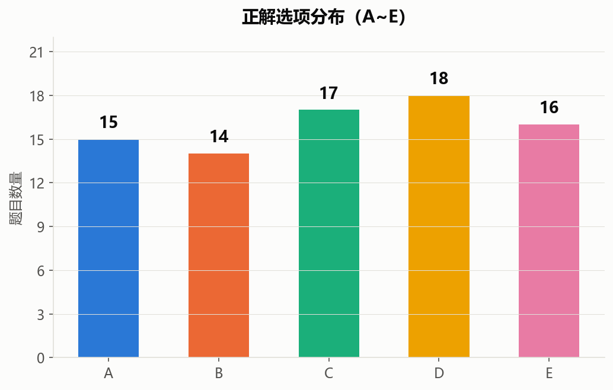
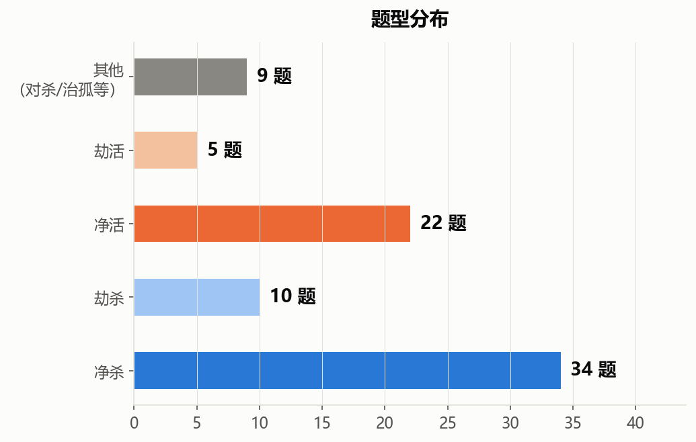
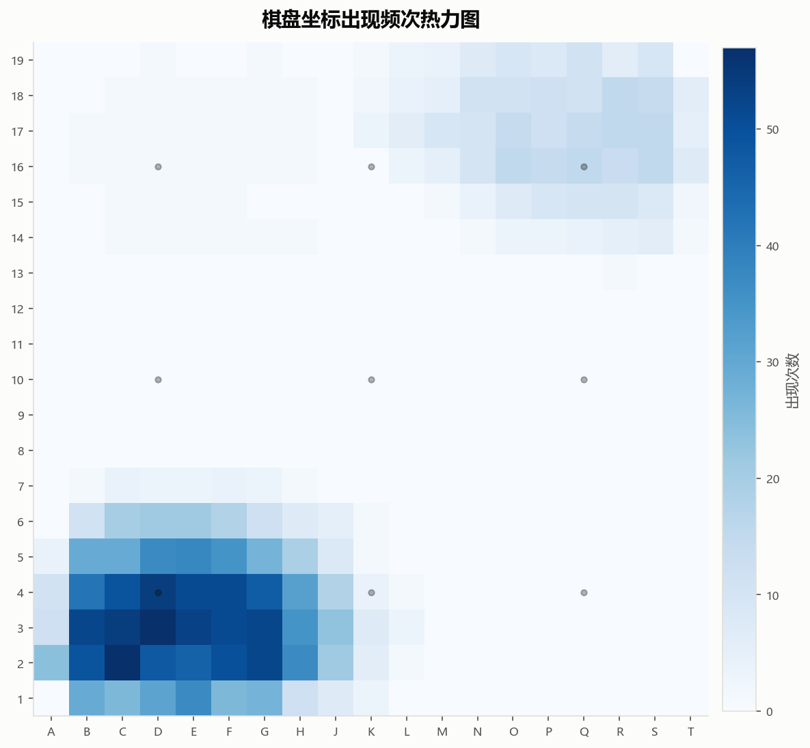
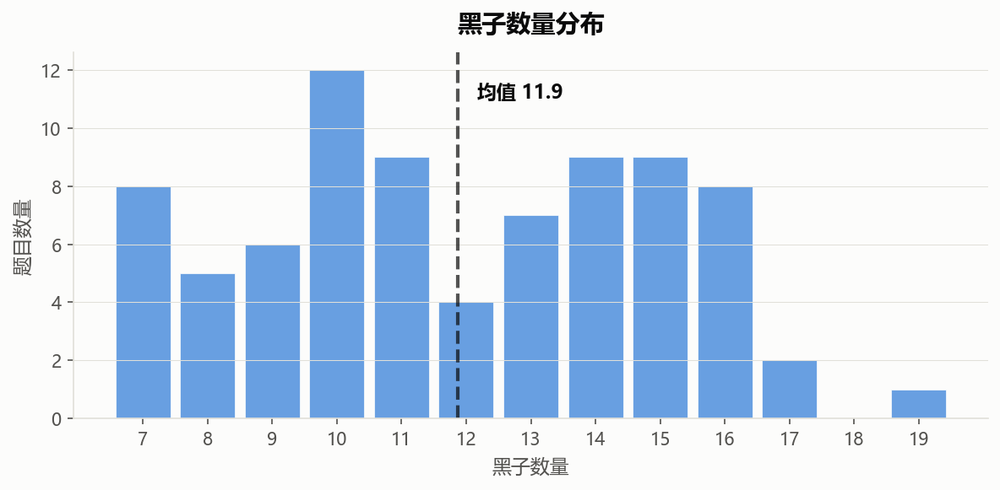
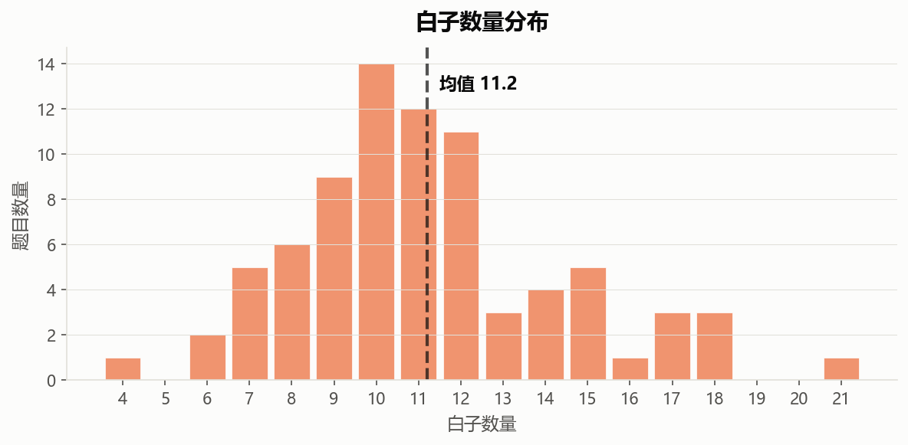

本死活题集为前田陈尔（Maeda Nobuaki，1907年—1975年）所著的死活题书《痛快》中的部分，以纯文本形式的单选题表述，方便衡量非多模态大模型的能力。因为前田陈尔已经去世超过50年，目前已经不存在著作权问题。该集共选入了80道题目，每道题目均包含题目介绍（其中有来源说明、题目要求、棋盘坐标、问题）、黑子坐标、白子坐标（所有坐标均以字母-数字表示）、ABCDE五个选项（其中第五个保证为"以上选项均不对"）、正确答案的序号。原书有误之处已经纠正，且保证每一道题目的正解第一手都不是脱先，保证ABCD中的坐标均为当前局面下的黑方合法落子着法的坐标。部分题目有多解，选项只会用其中的一种。感谢B站up主 @明玥谈棋 在讲解《痛快》中对本测试集选项设置的启发。由于是人工输入，难免会有错误，尚祈批评指正。

## 统计图

### 正解选项分布（A~E）

### 题型分布（净杀 / 劫杀 / 净活 / 劫活 / 其他）

### 棋盘坐标出现频次热力图

（统计所有题目中黑子、白子及选项坐标的出现次数）

### 黑子数量分布

（含均值线）

### 白子数量分布

（含均值线）

